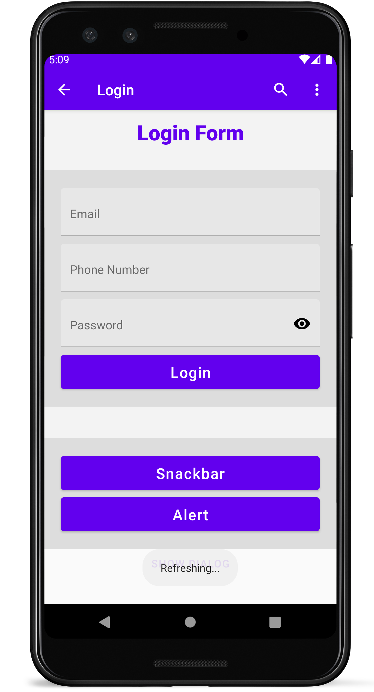

# React Native Material UI using react native paper

if your have problems running this, go to `android/local.properties`

and Add SDK path

npx react-native start
npx react-native run-android

✅ Added Material UI ( react-native paper)

✅ Snackbar

✅ Dialog

❌ Form

❌ Validation

# Screenshots



## Adding Fonts

1. Create a file named react-native.config.js in the root folder of your project

2. Write this code

```
module.exports = {
project: {
    ios: {},
    android: {},
},
assets: ['./assets/fonts']
};
```

3. use `react-native link` or `npx react-native link`
